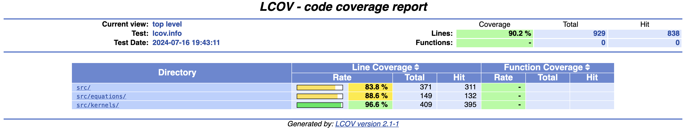
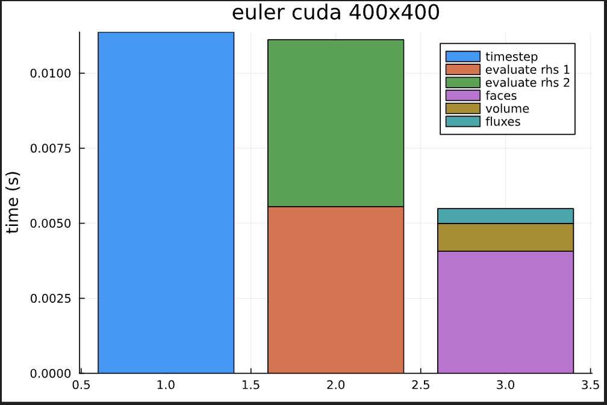
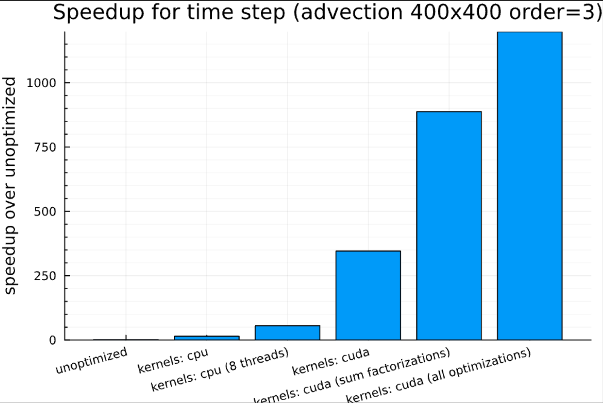
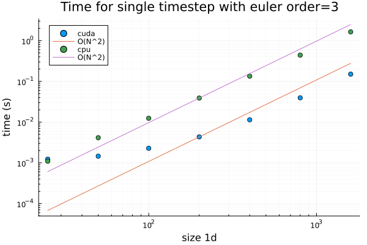
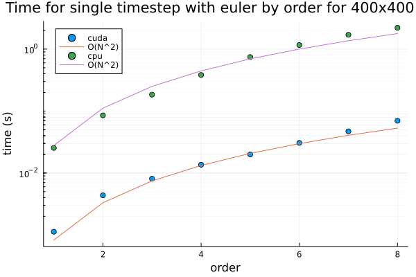

# ⭐ TerraDG.jl on the GPU

<!-- [](http://www.youtube.com/watch?v=3WDuZH6MymY "Euler equations solution") -->


This is a solution of the Euler equations using the TerraDG.jl package on the GPU. The video shows the density of the fluid at different time steps. The simulation is run on a 500x500 grid with a fourth-order solver.

### Running the code

- Clone the repo
- Start Julia in the root directory of the project with `julia --project=.`. Optionally, you can set the number of threads with `export JULIA_NUM_THREADS=8`.
- Run `] instantiate` to install the dependencies.
- Run `include("src/main.jl")` to run the code. You can change the parameters in the `main.jl` file. Note that the increased complexity and number of dependencies of the project increased precompilation time, sometimes taking up to around 3 minutes.

In addition to the parameters from the worksheets, you can specify the following parameters in the input file:

- `solver.slope_limiting: true`: Activate minmod slope limiting.
- `simulation.device: cuda:3`: Select the device to run the simulation on. The default is `cpu`. Allowed values are `cpu`,`cuda`, `cuda:X`, where `X` is the device number, `amdgpu`, `amdgpu:X`, where `X` is the device number.
- `simulation.float_type: Float32`: Select the floating point precision. Allowed values are `Float32` and `Float64`.
- `output.save_images: true`: Save plots of each dof in the `plots` folder.
- `output.log_level: warn`: Set the log level. Allowed values are `debug`, `info`, `warn`, `error`.

### Running the code with Docker

- Build the Docker image with `docker build -t terradg .`.
- Run the Docker container with `docker run -it terradg`. This will start an interactive Julia session in the TerraDG project.
- Run your experiment using `using TerraDG; TerraDG.main("src/input/advection.yaml")`.

If you also wish to play with the inputs and inspect the plots, you can mount the`src/input`, `output` and `plots` directories to your host machine. First create the folders if they do not exist: `mkdir plots;mkdir output`. For example, run `docker run -it -v $(pwd)/src/input:/app/src/input -v $(pwd)/output:/app/output -v $(pwd)/plots:/app/plots terradg`. Note that GPU acceleration is not available in the Docker container.

### Folder structure

- `src`: Contains the source code of the project.
- `results`: Contains documentation for all worksheets
- `benchmark`: Contains benchmarking scripts and results
- `output`: Contains the output of the simulation in vtk format. Can be opened with Paraview.
- `plots`: Contains plots of the simulation. Can be disabled in the input file.
- `test`: Contains the tests for the project.
- `worksheets.ipynb`: Contains the output of all worksheets in a Jupyter notebook. Running this notebook runs all the worksheet configs. In the `cuda_video_output` branch, this file contains the output as a video. However, we experienced compatibility issues.

### Branches and tags

- branch `main`: Contains the project implementation with all optimizations.
- tags `worksheet-X` (X=1,2,3,4): Contains the implementation of the respective worksheet.
- branch `cuda_video_output`: Contains the implementation of the video output for the Euler equations on the GPU in the `worksheets.ipynb` file.
- branch `cuda_derivative_factorization`: Contains the project but without the surface integral optimization. More flexible (we do not make assumptions about the order of the cells here) and readable code but around 30% slower.

### Testing

Run `] test` to run the tests.



---

# Project Report

## Goal of the project

We aim to optimize the performance of the DG solver by offloading the computations to the GPU, preserving all functionality from the worksheet.
For the output of all worksheets, see [this jupyter notebook](worksheets.ipynb).

## Features

- All computations from all worksheets can be run on the GPU.
- Hardware-agnostic implementation: The kernels can run on multi-core CPUs, NVIDIA GPUs, and partially on Metal GPUs through the `KernelAbstractions.jl` package. AMD GPUs should also be supported, but we do not have access to the hardware for testing.
- The floating point precision can be specified.

## Implementation details

We implement all computations running for every cell in every time step, i.e., the evaluation of fluxes, volume, and surface integrals, in a custom kernel. A kernel is a function that can be run in parallel with different arguments on an accelerator device, such as a GPU. We structure our code so that each kernel function call evaluates a single cell. See, for example, the `evaluate_fluxes` function in `src/kernels/flux.jl`:

```julia
@kernel function evaluate_cell_flux(flux)
    cell_id = @index(Global)
    cellflux = @view flux[1:order^2 * 2, 1:ndofs, cell_id]
    celldofs = SMatrix{order^2,ndofs,F}(@view dofs[1:order^2, 1:ndofs, cell_id])
    evaluate_flux(eq, celldofs, cellflux)
end
kernel = evaluate_cell_flux(backend)
kernel(grid.flux,ndrange=length(cells))
KernelAbstractions.synchronize(backend)
```

This is done for all expensive operations of the solver, including the evaluation of surface integrals, volume integrals, the evaluation of fluxes, the evaluation of the degrees of freedom for plotting, slope limiting, error computation and the time integrator. We synchronize after each kernel call to ensure that the GPU has finished the calculation before we continue with the next step.

Importantly, no dynamic memory allocations are allowed on the GPU. However, many kernels rely on matrix operations to process a single cell. We use the `StaticArrays.jl` package to create fixed-size arrays that can be passed to the kernels. This way, we can avoid dynamic memory allocations on the GPU.

## Optimizations
Profiling with Nvidia nsight systems and nsight compute reveals that the code, while it already achieves a significant speedup, has a lot of potential for improvement. The kernel accounting for the majority of runtime is the surface integral:



The time stepping `SSPRK2` requires two evaluations of the right-hand side of the step equation. In each of those two calls, the computation of the face integrals takes up around 3/4 of the runtime. Therefore, we focus our optimizations on this kernel.

1. **Memory layout**: Threads on the GPU within one warp always access consecutive addresses in memory. Our data was sorted by cell, so that the data of each thread in a single access is far apart in memory, causing almost all data transferred in one access to be unused. We tried to improve this by switching the memory layout so that the same variable for different cells are next to each other in memory. The profiler shows that the average number of utilized bytes per memory access went up to 27.7/32 from 1.0/32. However, it did not lead to a significant speedup, likely because the memory access pattern is still not otimal as indicated by the profiler.
2. **Processing Faces instead of cells**: Instead of processing one cell at a time, as the other kernels, the face integral kernel now computes one face at a time. This avoids computing the same numerical flux twice and saves several memory accesses of fetching cell data. The number of transferred bytes in this kernel was reduced by more than half as a result. Moreover, we use 4 different buffers to store updates to each cell, one per face, that are reduced once in the end. This allows us to avoid synchronization within the kernel or between faces, reducing overall waiting time due to synchronization by 66%.
3. **Sum factorizations**: Profiling reveals that we are heavily memory-bound. One way in which we address this is by implementing sum factorizations for the derivative matrix and all projections. This reduces the size of constant arrays to be stored from $O((\text{order}^2)^2)$ to $O(\text{order}^2)$. In our profiling scenario, we could reduce the number of Bytes transferred to/from device meory bay another factor of 8. Another benefit of sua factorizations is that it enables us to run the code with orders up to 8 by reducing the kernel parameter size. Previously, the parameter limit restricted the order to $\leq 3$.


The scenario used for profiling of all versions of the code is advection of order 3 with a 200x200 grid.

## Performance

### Comparison between implementations

We present the speedup of the DG solver for a single time step of the advection equation for a 400x400 grid with a third-order solver below:



We measure the performance of our code on an AMD Zen2-based server running Ubuntu 20.04.02 LTS, Linux kernel version 5.4.0-81.
The system's processor is an AMD EPYC 7402 24-core CPU operating at 2.8GHz. Eight channels of DDR4-3200 DRAM provide a main memory bandwidth of 204.8GB/s, and the shared L3 cache is 128MB in size. The GPU we use for testing is an RTX 3080 (10GB version) from the Ampere generation of Nvidia GPUs.

We achieve a speedup of up to 14x compared to the base implementation without parallelization on the CPU by avoiding dynamic memory allocations through StaticArrays. In other words, making the code compatible with the GPU significantly improves the performance on the CPU as well.
By utilizing eight threads on the CPU, the speedup reaches 55x compared to the base implementation, corresponding to a scaling efficiency of 3.8 with the number of threads.
Our first GPU implementation reaches a speedup of 300x compared to the base implementation. With sum factorization, the speedup goes up to 800x. Finally, with all optimizations combined, we get a speedup of 1200x.

### Scaling of the sum-factorized implementation

The following plot shows that our final implementation scales roughly linear in the number of cells (or quadratic in the 1d grid size) for the sum-factorized cuda implementation, both on CPU and GPU. However, on the GPU, we have a significant overhead for kernel launches at small grid sizes.



Further, the following graphic shows that the runtime scales roughly quadratically with the order of the solver.



